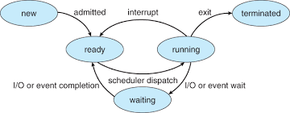
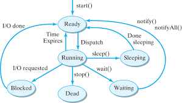
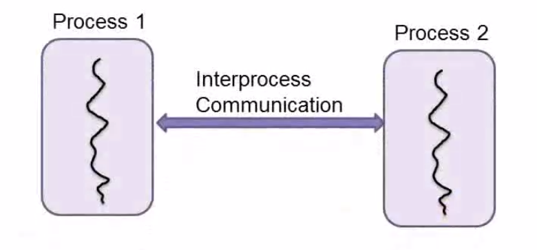
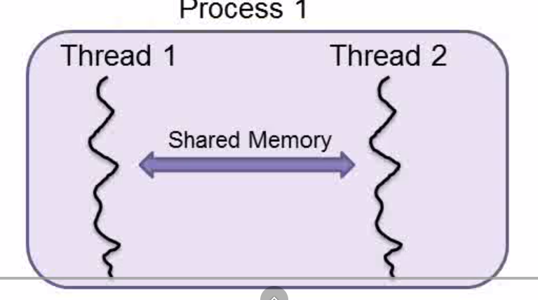

# CONCURRENCY

## ESSENTIAL BACKGROUND

### 🏭 What is a Process?
A Process is an instance of a computer program that is being executed. Think of it as a container that the Operating System (OS) creates to run an application. It has its own dedicated:

- **Address Space:** A private block of memory.

- **Resources:** Handles to files, network sockets, and security attributes.

- **State:** Information about whether it is running, waiting, or stopped.

- Possible states of a process:

### 🏭 What is a Thread?

A Thread is the smallest unit of execution within a process. If a process is the "factory," threads are the "workers" inside it. A process must have at least one thread (the main thread), but it can have many.

- Threads share the memory and resources of the process they belong to.
- Each thread has its own Stack (for local variables) and Registers (including the Program Counter to track which instruction it's currently on).
- Possible states of a thread:

<b>1. The Ready State</b>

Technically, a thread in the Ready state is a schedulable entity residing in the system's Run Queue (or Ready Queue).

- **Resources:** It holds a valid Thread Control Block (TCB) and has all necessary resources (memory allocation, file handles, socket connections) except for the **CPU execution time**.
- **Context:** Its execution context (Register Set, Stack Pointer, and Program Counter) is currently saved in memory, waiting to be loaded onto the hardware.

- <b>Why is it here?</b>
    - **Admission:** It was just created via start().
    - **Preemption:** It was previously running, but the Scheduler interrupted it because its Time Quantum (slice of CPU time) expired or a higher-priority thread became available.
    - **Unblocking:** It finished an I/O operation (like reading a file), and the OS moved it from Blocked back to Ready.

<b>2. Running State</b>

- The transition from Ready to Running happens via a mechanism called **Dispatch**.
- To initiate the Running state, the OS performs a Context Switch. It loads the thread's saved state into the CPU's physical registers. 
- This CPU register  is the EIP/RIP(Instruction Pointer). Note : The `CR3` points to the **Page Table** (the map of the address space). It tells the hardware where memory is located.

<b>3. The Waiting State</b>
- Here, the thread is alive but cannot run.
- Technically, a thread enters the Blocked state when it initiates a **Synchronous I/O request** (like reading from a disk or network) or waits on a **Synchronization Primitive** (like a Mutex or Semaphore).
  - **Resources:** It retains its TCB and memory, but it is removed from the Run Queue. The OS places it into a specific Wait Queue associated with the event it is waiting for.
  - **CPU Usage:** 0%. It is effectively "asleep" to the scheduler.
- **NOTE:** The thread once woke up from the waiting state, needs to wait until CPU is available, i.e. it must stand in the queue(blocked state), then go to the running when CPU is available(based on the scheduling).

<b>4. The Terminated (Dead) State</b>
- A thread enters in this state when it's main function returns or it calls `pthread_exit`.
- When a thread dies, the process might still be alive (other threads are still running).

<b>5. The Sleep state</b>
- The OS treats this as a special type of `blocked` state.
- NOTE: Busy waiting is the `while` loop for waiting. Thus, the thread is still in a `running` state. The CPU usage is `100%` (for that core).
- Sleeing however is when OS removes it temporarily from the CPU. The CPU usage is `0%` when sleeping.

### ⚖️ Key Differences

The fundamental difference lies in isolation and sharing:

- **Memory:** Processes are isolated from each other; one process cannot easily peek into another's memory. Threads share the same heap memory of their parent process.
- **Creation & Overhead:** Creating a process is "heavy" because the OS must allocate a whole new memory space. Creating a thread is "light" because it just hitches a ride on the existing process memory.
- **Communication** Processes need complex mechanisms (IPC) to talk. Threads can talk simply by reading/writing to shared variables (though this requires careful coordination!).

 <h2>The Interrupt LifeCycle</h2> 

This cycle is the hardware-software handshake that keeps the system responsive.

The lifecycle generally follows four main stages.

<h3>The Request</h3>

A hardware device (like a network card receiving a packet) asserts a signal on the interrupt line to the CPU.

<h3> The Pause & Save </h3>

- The CPU acknowledges the signal. It finishes the exact instruction it is currently executing, but it doesn't fetch the next one. Instead, it needs to save its current spot.
- It pushes the Program Counter (PC) (which points to the next instruction) and the Status Register onto the Kernel Stack.
- If we didn't save the status register (which contains flags like zero, overflow or negative from the last math operation), we might run into a *segmentation fault* error.

<h3>The Service</h3>

The CPU loads the address of the specific Interrupt Service Routine (ISR)—a small function in the OS kernel designed to handle that specific device. It jumps to that code and executes it.

<h3> The Restore & Resume </h3>

Once the ISR is done, it executes a special "Return from Interrupt" instruction. The CPU pops the saved Program Counter and registers off the stack, putting everything back exactly how it was. The original process resumes as if nothing ever happened.

 <h2> Context Switching </h2>

Scheduler does the context switching.

For context switching, the OS updates a register (like CR3 on x86) that points to the **Page Table** - the map that translates "virtual addresses" (what the program sees) to "physical RAM" (where data actually lives).

**The "Hidden Cost" of Process Switching**

When the OS switches the Page Table, the CPU's special memory cache—called the TLB (Translation Lookaside Buffer)—becomes useless because it holds the old process's addresses.

- The OS flushes (deletes) the TLB.
- The new process starts running, but it's slow at first because the CPU has to look up every single memory address from scratch until the TLB fills up again.

**The Thread Advantage**

Because threads share the same address space (and the same Page Table), the OS does not need to flush the TLB when switching between threads of the same process. It just saves the registers and switches the stack.

*This is why multi-threading is so much faster than multi-processing.*

## Synchronization

**The problem:**

Imagine we have a shared variable int counter = 0; and two threads (A and B) both trying to run the line counter++.

Incrementing (counter++) actually takes 3 distinct CPU steps:
- **LOAD** value from memory to register.
- **ADD** 1 to the register.
- **STORE** value from register back to memory.

**A possible scenario:**
1. **Thread A** runs Step 1: It reads `0`.
2. **Interrupt!** The Schedule pauses thread A and runs thread B.
3. Thread B runs all the 3 steps. It reads 0, adds 1, and writes 1 to memory.
4. The Scheduler switches back to Thread A.
5. Thread A resumes exactly where it left off (with 0 in its register). It runs Step 2 (ADD) and Step 3 (STORE).
6. Thus, thread A also writes 1, while thread B also writes one. The final value which should have been 2, is now 1, because the operations were not thread-safe! (A typical case of race condition).

**The Critical Section:**
- The part of the code that accesses the shared variable (the counter++) is called the Critical Section.
- To fix this, we need to make those three steps (Load, Add, Store) **Atomic**. "Atomic" comes from Greek meaning "indivisible." We want them to happen all at once, so no other thread can interrupt in the middle.
- Thus, we make use of a mechanism called mutex(mutual exclusion), to ensure that only one thread enters the critical section at a time.
- Here's how a mutex works in a thread lifecycle:
  - **Acquire:** Before entering the Critical Section, a thread calls mutex.lock().
    - If the mutex is unlocked, the thread locks it and proceeds. ✅
    - If the mutex is locked (owned by another thread), the calling thread is Blocked and placed in a wait queue.
  - **Critical Section:** The thread executes the code (e.g. counter++)
  - **Release:** The thread calls `mutex.unlock`, which wakes up a waiting thread (if any) and lets it proceed.

**The Ultimate Standoff - DEADLOCKS**

Imagine two threads, **Thread A** and **Thread B**, and two resources, **Resource X** and **Resource Y**.

1. Thread A grabs resource X.
2. Thread B grabs resource Y.
3. Now, Thread A tries to grab Resource Y (waiting for B to release it).
4. At the same time, Thread B tries to grab Resource X (waiting for A to release it).

*Both threads are stuck waiting for the other to finish. Neither can move forward, and neither will release what they have.*

> A **deadlock** is a situation where a set of processes are blocked because each process is holding a resource and waiting for another resource that is being held by some other process. Because everyone is waiting and no one is giving up what they have, the system freezes indefinitely.

<h3>FOUR NECESSARY CONDITIONS OF A DEADLOCK (COFFMAN Conditions):</h3>

*For a deadlock to occur, all four of these conditions must be true simultaneously. **If you can break just one, you prevent the deadlock**.*

**1. Mutual Exclusion:**
- At least one resource must be held in a non-shareable mode. Only one process can use it at a time (like a printer or a specific memory address). If another process requests that resource, it has to wait.

**2. Hold and Wait:**
- A process must be holding at least one resource and waiting to acquire additional resources that are currently being held by other processes.

**3. No Preemption:**
- Resources cannot be forcibly taken away from a process. They must be released voluntarily by the process holding them after it has finished its task.

**4. Circular Wait:**
- There must be a set of processes {*P0,P1,…,Pn*} such that *P0* is waiting for a resource held by *P1*, *P1* is waiting for *P2*, and so on, until *Pn* is waiting for *P0*, completing the circle.

<h4>Breakoffs</h4>

**1. How do we break the mutual exclusion condition?**
- Make the resource read-only. If everyone has access to the resource at the same time, no one gets blocked waiting for exclusive access, so deadlock is impossible.

**2. How do we break the hold and wait condition?**
- Make the acquisition of resource **atomic** (all or nothing). *If you can't get the fork and the knife for your dinner, pick up neither, leaving the resources free for someone else.*

**3.How do we break the No Pre-emption condition?**
- If a process is holding some resources (like Resource A) and requests another one (Resource B) that it cannot have immediately, the OS forces it to release all the resources it is currently holding. 🔓
- The process is then effectively "kicked out" of the resources it had. It must go back to waiting and can only restart when it can get Resource A AND Resource B at the same time.

> **NOTE:** For resources like CPU or memory, we cache the state(save context to the stack/PCB), so the process can resume exactly where it left off without losing anything. However, this "Use it or Lose it" strategy (Preemption) gets messy with I/O devices.

This was the breaking strategy. To avoid a deadlock, there's something called a Banker's algorithm.

## Lectures

Generally, there are two kinds of concurrent programming models : 
- **Multi-processing**
  
  - 
  - Here, each process only has one thread running and other processes communicate with each other through the regular Inter-Process Communication (IPC) channels, such as files, types, message queues, etc.

- **Multi-threading**
  
  - 
  - One process contians two or more threads and other threads communicate with each other through shared memory.
  - **PROS:**
    - Faster than process
    - Lower overhead than process
  - **CONS:**
    - Difficult to implement
    - Can't run on distributed systems

  - *Argument for communication in multi-threading is that the threads should NOT communicate using shared memory, instead they must use some communication channel, that are similar to IPC channels. That way, a multi-threading program can be run on distributed systems too. Besides, the programming becomes easier this way.*

- In practical life, you can also within the same program, some processes are single threaded, while some are multi-threaded.

| Feature | Multi-processing 🖥️ | Multi-threading 🧶 |
| :--- | :--- | :--- |
| **Memory** | Isolated address space per process. | Shared address space within one process. |
| **Communication** | **Inter-Process Communication (IPC)**: Pipes, Sockets, Message Queues. | **Shared Memory**: Global variables, heap. |
| **Overhead** | **High**: Context switching involves updating memory maps (TLB flush). | **Low**: Threads share the same memory map; faster context switching. |
| **Fault Tolerance** | **Strong**: A crash in one process doesn't usually kill others. | **Weak**: A crash in one thread (e.g., Segfault) can kill the whole process. |

